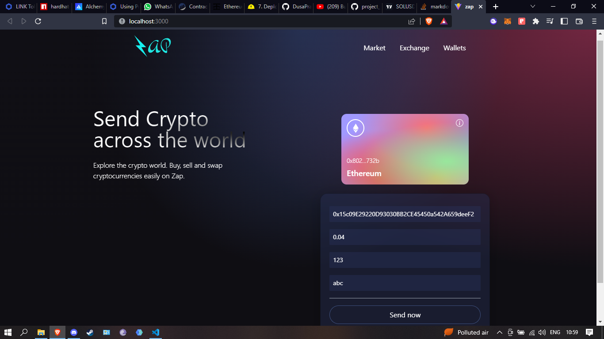

# web3.0-application

[https://ethtxn.netlify.app/](https://dapp-testnet-goerli.netlify.app/)

### Basic Setup

vite
hardhat
tailwind.css

### Command

use command - npm run dev

### Change variables

contract address in constant.js
private key, url in hardhat.config.js

